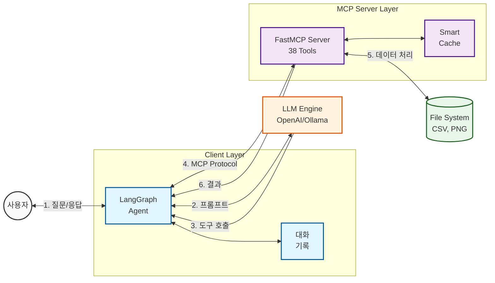

# MCP Advanced Data Analysis System


**38개의 전문가급 데이터 분석 도구**를 제공하는 MCP(Model Context Protocol) 기반 데이터 분석 시스템. OpenAI 및 Ollama 모델을 지원하며, 대화형 인터페이스를 통해 즉각적인 데이터 분석을 수행합니다.

> 🔌 **LLM에 연결하면 실제로 어떤 인풋/아웃풋이 오가는지** 궁금하다면:
> [docs/LLM_INTEGRATION.md](docs/LLM_INTEGRATION.md) — 실측 4턴 세션 로그 포함
> (재현: `python examples/demo_session.py`)

---

## System Architecture

본 시스템은 **MCP 프로토콜**을 기반으로 LLM 에이전트가 38개의 데이터 분석 도구를 자동으로 호출하여 탐색, 전처리, 시각화, 모델링, 통계 분석을 수행합니다.



## Core Components

| Component | Technology | Role |
|-----------|-----------|------|
| **LLM** | OpenAI (gpt-4o-mini) / Ollama (qwen2.5:72b) | 자연어 이해 및 도구 호출 결정 |
| **MCP Server** | FastMCP | 38개 데이터 분석 도구 제공 |
| **Agent Framework** | LangGraph + LangChain | 대화 상태 관리 및 도구 실행 |
| **Data Processing** | pandas, numpy, scikit-learn | 데이터 조작 및 ML 모델링 |
| **Visualization** | matplotlib, seaborn, Plotly | 정적(PNG)·인터랙티브(HTML) 시각화 |
| **Caching** | In-memory Dictionary | 스마트 캐싱으로 50% 성능 향상 |

---

## MCP Server Tools (38 Total)

본 시스템은 **8개 모듈**로 구성된 38개의 전문가급 도구를 제공합니다.

### 📂 Module 1: Data Exploration & Profiling (4 tools) — `tools/exploration.py`

| Tool | Description |
|------|-------------|
| `get_dataset_info` | 데이터셋 기본 정보 (shape, dtypes, 결측치) |
| `profile_dataset` | 종합 프로파일링 (통계량, 상관관계, 분포) |
| `detect_data_types` | 컬럼별 데이터 타입 자동 분류 |
| `find_duplicates` | 중복 행 탐지 및 카운트 |

### 🧹 Module 2: Data Preprocessing (5 tools) — `tools/preprocessing.py`

| Tool | Description |
|------|-------------|
| `handle_missing_values` | 결측치 처리 (mean, median, mode, drop, ffill) |
| `detect_outliers` | 이상치 탐지 (IQR, Z-score 방법) |
| `remove_outliers` | 이상치 제거 (탐지된 전체 제거) |
| `encode_categorical` | 범주형 변수 인코딩 (Label, One-hot) |
| `scale_features` | 특성 스케일링 (StandardScaler, MinMaxScaler) |

### 🛠️ Module 3: Feature Engineering (3 tools) — `tools/feature_engineering.py`

| Tool | Description |
|------|-------------|
| `create_derived_feature` | 수식 기반 파생 변수 생성 (`df.eval`) |
| `create_polynomial_features` | 다항·교호작용 피처 생성 |
| `extract_datetime_features` | 날짜/시간 피처 추출 (year, month, dayofweek 등) |

### 📊 Module 4: Visualization (11 tools) — `tools/visualization.py`

| Tool | Description |
|------|-------------|
| `plot_histogram` | 히스토그램 (bins, KDE, 색상, 레전드 커스터마이징) |
| `plot_boxplot` | 박스플롯 (이상치 시각화) |
| `plot_scatter` | 산점도 (레전드, 마커 크기, 투명도, 색상 팔레트) |
| `plot_line` | 라인 차트 — 시계열 트렌드 (그룹별 다중 라인, 리샘플링, `interactive` 지원) |
| `plot_bar` | 막대 차트 — 범주 빈도 또는 집계값 (top_n, `interactive` 지원) |
| `plot_correlation_heatmap` | 상관관계 히트맵 |
| `analyze_target_distribution` | 타겟 변수 분포 분석 및 불균형 탐지 |
| `plot_interactive_scatter` | 인터랙티브 산점도 (Plotly HTML) |
| `plot_interactive_histogram` | 인터랙티브 히스토그램 (Plotly HTML) |
| `plot_interactive_boxplot` | 인터랙티브 박스플롯 (Plotly HTML) |
| `plot_interactive_heatmap` | 인터랙티브 상관관계 히트맵 (Plotly HTML) |

### 🧭 Module 5: Auto Visualization (2 tools) — `tools/auto_viz.py`

**어떤 데이터를 넣어도** 컬럼 역할(수치/이산/범주/날짜/ID/텍스트)을 자동 판별해
알맞은 시각화를 추천하고, 추천된 방법으로 결과물을 바로 생성합니다.

| Tool | Description |
|------|-------------|
| `recommend_visualizations` | 데이터 자동 분석 → 근거 있는 차트 추천 목록 + 실행 가능한 tool_call 반환 |
| `plot_auto` | 컬럼 1~3개(또는 생략)만 주면 역할 조합으로 차트 자동 선택·렌더링 (`interactive` 지원) |

**차트 선택 규칙:** 수치→히스토그램 · 범주→막대 · 수치×수치→산점도 · 수치×범주→박스플롯 ·
날짜×수치→라인 · 범주×범주→교차표 히트맵 · +범주 1개→hue/그룹 분리

### 🤖 Module 6: Machine Learning (3 tools) — `tools/ml.py`

| Tool | Description |
|------|-------------|
| `compare_models` | RandomForest, XGBoost, LogisticRegression, SVM 성능 비교 |
| `evaluate_model` | Confusion Matrix, Feature Importance, 상세 메트릭 평가 |
| `tune_hyperparameters` | GridSearchCV / RandomizedSearchCV 하이퍼파라미터 튜닝 |

### 📐 Module 7: Statistical Analysis (6 tools) — `tools/statistics.py`

| Tool | Description |
|------|-------------|
| `calculate_correlation` | 상관계수 계산 (Pearson, Spearman, Kendall) |
| `test_normality` | Shapiro-Wilk 정규성 검정 |
| `test_ttest` | 독립 T-검정 (두 그룹 평균 비교) |
| `test_anova`  | 일원 분산분석 (다중 그룹 비교) |
| `test_chi_square` | 카이제곱 독립성 검정 (범주형 변수) |
| `calculate_confidence_interval` | 신뢰구간 계산 (평균값 추정) |

### 💾 Module 8: Data & Results Management (4 tools) — `tools/exploration.py`, `tools/results.py`

| Tool | Description |
|------|-------------|
| `list_cached_datasets` | 현재 캐시된 데이터셋 목록 조회 |
| `clear_cache` | 메모리 캐시 초기화 (특정 파일 또는 전체) |
| `view_chart` | **생성된 차트를 대화창에 바로 표시** — PNG를 MCP 이미지 콘텐츠로 반환 (Claude Desktop 등 멀티모달 클라이언트에서 인라인 렌더링) |
| `list_outputs` | 지금까지 생성된 결과 파일 목록 (최신순, 인라인 표시 가능 여부 포함) |

> 동봉 CLI 클라이언트(`data_client.py`)는 텍스트 전용 로컬 LLM에서도 결과를 바로 볼 수 있도록,
> 각 턴이 끝나면 새로 생성된 차트를 OS 기본 뷰어로 자동으로 엽니다 (`AUTO_OPEN_RESULTS=0`으로 비활성화).

---

## Project Structure

```
Data-Analyze-MCP/
├── src/
│   └── data_analysis/          # [Core] MCP 서버 패키지
│       ├── __main__.py         #   진입점 (python -m data_analysis)
│       ├── server.py           #   공유 FastMCP 인스턴스
│       ├── config.py           #   환경변수 기반 설정
│       ├── cache.py            #   데이터셋 캐시 / 로더
│       ├── helpers.py          #   공통 검증·플로팅·ML 헬퍼
│       ├── fonts.py            #   한글 폰트 설정
│       ├── prompts.py          #   MCP 기본 프롬프트
│       └── tools/              #   도메인별 도구 모듈
│           ├── exploration.py         # 탐색·프로파일링
│           ├── preprocessing.py       # 결측치·이상치·인코딩·스케일링
│           ├── feature_engineering.py # 파생·다항·시계열 피처
│           ├── visualization.py       # 정적/인터랙티브 시각화
│           ├── auto_viz.py            # 시각화 자동 추천·렌더링
│           ├── results.py             # 결과물 인라인 표시·목록
│           ├── ml.py                  # 모델 비교·평가·튜닝
│           └── statistics.py          # 상관·가설검정
├── data_client.py              # [UI] LangGraph 기반 대화형 클라이언트
├── generate_all_test_data.py   # [Scripts] 테스트 데이터 생성기
├── pyproject.toml              # 패키지 메타데이터 (src-layout)
├── requirements.txt            # 의존성 목록
├── README.md                   # 프로젝트 문서
└── .gitignore                  # Git 제외 설정
```

---

## Getting Started

### 1. Prerequisites

**필수 요구사항:**
- Python 3.11+
- OpenAI API Key 또는 Ollama 실행 중

**Ollama 사용 시 (무료):**
```bash
ollama pull qwen2.5:72b
```

### 2. Installation

```bash
# 방법 A) 패키지로 설치 (권장) — `data-analysis` 명령과 python -m 둘 다 사용 가능
pip install -e .

# 방법 B) 의존성만 설치 — 클라이언트가 ./src 를 PYTHONPATH에 얹어 서버를 실행
pip install -r requirements.txt
```

### 3. Configuration

설정은 환경변수로 제어합니다 (코드 수정 불필요). `.env` 파일 또는 셸에서 지정:

**OpenAI 사용:**
```bash
export LLM_BACKEND=openai
export MODEL_NAME=gpt-4o-mini
export OPENAI_API_KEY=sk-...
```

**Ollama 사용 (무료, 기본값):**
```bash
export LLM_BACKEND=ollama
export MODEL_NAME=qwen2.5:72b
export OLLAMA_URL=http://localhost:11434
```

**기타 설정 (선택):** `MCP_OUTPUT_DIR`(생성물 저장 위치, 기본 `outputs/`),
`MCP_CLASSIFICATION_MAX_UNIQUE`(분류/회귀 판별 임계값).

---

## Usage

### Step 1: 클라이언트 실행

클라이언트가 서버(`python -m data_analysis`)를 stdio로 자동 기동하므로 별도로
서버를 띄울 필요가 없습니다.

```bash
python data_client.py
```

> 서버만 단독 실행하려면: `data-analysis` (설치 시) 또는 `PYTHONPATH=src python -m data_analysis`

접속 성공 시:
```
============================================================
 MCP 데이터 분석 시스템 - Model: qwen2.5:72b
============================================================
Tip: 이전 대화를 기억합니다. 자연스럽게 대화하세요!
 예: '이제 이상치를 제거해줘', '그 결과를 시각화해줘'
 Commands: 'clear' - 대화 초기화, 'exit/종료' - 종료
============================================================

You:
```

### Step 2: 테스트 데이터 생성 (선택)

```bash
python generate_all_test_data.py
```

생성되는 파일:
- `customer_churn.csv` - 7,043행, 분류 문제
- `house_price.csv` - 545행, 회귀 문제
- `sales_timeseries.csv` - 1,000일, 시계열 분석

---

## Examples

### 데이터 탐색
```
You: customer_churn.csv를 프로파일링해줘

AI: [통계량, 결측치, 상관관계 등 종합 분석 결과 출력]
```

### 시각화 (커스터마이징)
```
You: area와 price의 산점도를 그려줘. bedrooms로 색상 구분하고, 
     레전드 제목은 '방 개수', 마커 크기는 80, 투명도는 0.7로 해줘

AI: [커스터마이징된 scatter_area_vs_price.png 생성]
```

### 통계 분석
```
You: contract_type별로 monthly_charges에 차이가 있는지 ANOVA 검정해줘

AI: ANOVA 결과:
    F-statistic: 245.67
    p-value: 0.0001
    해석: 계약 유형별로 월 요금에 유의한 차이가 있습니다 (p < 0.05).
```

### 머신러닝
```
You: customer_churn.csv에서 churn을 타겟으로 
     RandomForest, XGBoost, LogisticRegression을 비교하고 
     최고 성능 모델을 상세 평가해줘

AI: [모델 비교 결과]
    최고 모델: RandomForest (Accuracy: 0.82)
    
    [evaluate_model 자동 실행]
    Precision: 0.76
    Recall: 0.71
    F1-Score: 0.73
    Feature Importance:
    1. monthly_charges: 0.23
    2. tenure: 0.19
    ...
    [confusion_matrix_RandomForest.png 생성]
```

---

## Advanced Features

### Visualization Customization

**plot_scatter 파라미터:**
```python
plot_scatter(
    csv_path="house_price.csv",
    x_column="area",
    y_column="price",
    hue_column="bedrooms",
    title="주택 면적과 가격 관계",
    xlabel="면적 (sqft)",
    ylabel="가격 ($)",
    figsize_width=12,
    figsize_height=8,
    marker_size=80,
    alpha=0.7,
    color_palette="Set2",
    show_legend=True,
    legend_title="방 개수",
    legend_position="upper left"
)
```

### Conversation History

대화 기록을 유지하여 연속적인 분석 가능:

```
You: customer_churn.csv를 불러와서 결측치를 확인해줘
AI: [결측치 11개 발견]

You: 평균값으로 채워줘
AI: [결측치 처리 완료]

You: 이제 이상치를 탐지해줘
AI: [monthly_charges에서 23개 이상치 발견]
```

`clear` 명령어로 대화 초기화 가능.

---

## Performance

| Metric | Value |
|--------|-------|
| **도구 개수** | 38개 |
| **캐싱 효과** | ~50% 속도 향상 (반복 작업 시) |
| **응답 시간** | 2-5초 (Ollama GPU 사용 시) |
| **메모리** | 최소 8GB RAM |
| **비용** | $0 (Ollama) / $0.15/1M tokens (gpt-4o-mini) |

---

## License

MIT License
