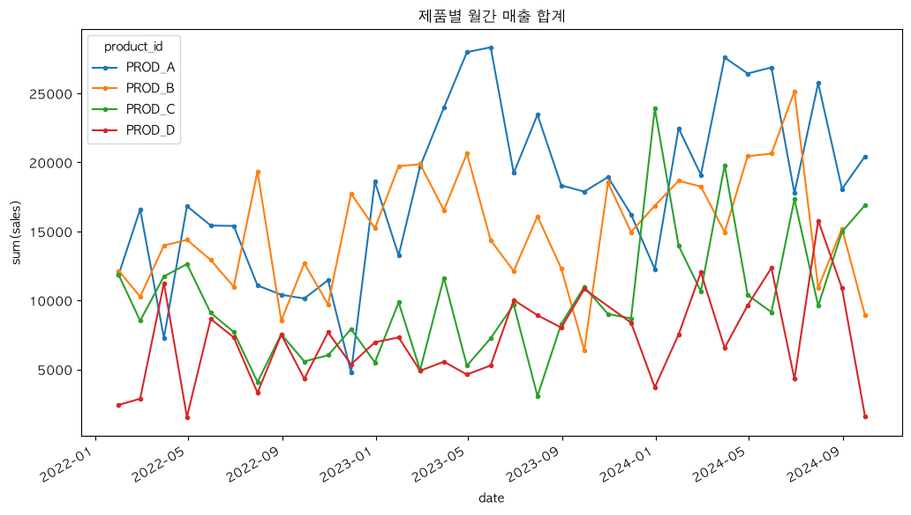
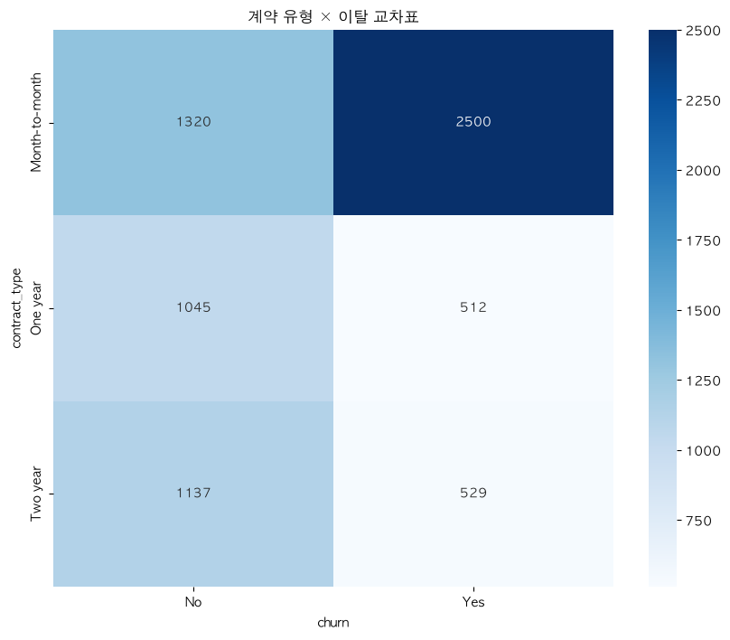
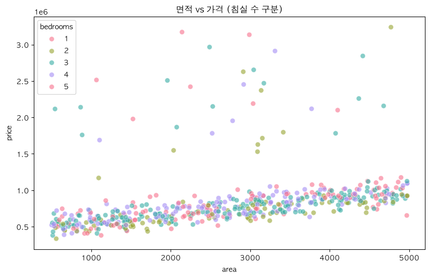
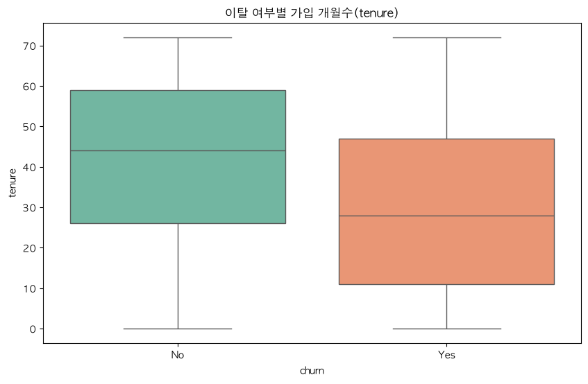
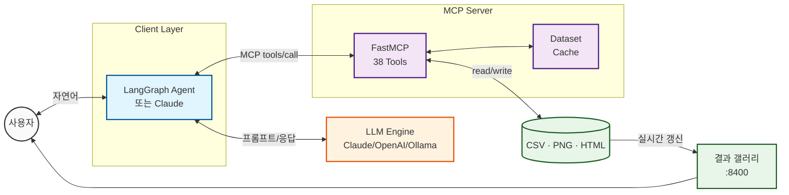

<div align="center">

# 📊 Data-Analyze-MCP

**자연어 한 마디로 데이터 탐색·시각화·통계검정·머신러닝까지 — LLM을 위한 MCP 데이터 분석 서버**

[](https://www.python.org/)
[](https://modelcontextprotocol.io/)
[](#-mcp-server-tools-38-total)
[](https://ollama.com/)
[](https://claude.ai/)

[빠른 시작](#-quick-start) · [결과물 예시](#-results) · [도구 목록](#-mcp-server-tools-38-total) · [LLM 연동 가이드](docs/LLM_INTEGRATION.md) · [아키텍처](#%EF%B8%8F-architecture)


</div>

---

## ✨ Features

- 🧭 **Auto Visualization** — *어떤 CSV를 넣어도* 컬럼 역할(수치/범주/날짜/ID...)을 자동 판별해 알맞은 차트를 **추천하고 그 자리에서 렌더링** (`recommend_visualizations` → `plot_auto`)
- 🖼️ **결과 즉시 확인** — 차트를 MCP 이미지로 대화창에 인라인 표시(`view_chart`), CLI에서는 OS 뷰어 자동 오픈, 웹 **결과 갤러리**(`data-analysis-viewer`)로 실시간 모니터링
- 🤖 **LLM 독립적** — Claude Desktop/Code, OpenAI API, 로컬 Ollama 어디에 붙여도 동일하게 동작 ([실측 세션 로그](docs/LLM_INTEGRATION.md))
- 🧰 **38개 전문 도구** — 프로파일링 · 전처리(결측/이상치/인코딩/스케일링) · 피처 엔지니어링 · 정적/인터랙티브 시각화 · 가설검정 · 모델 비교/평가/튜닝
- 🇰🇷 **한국어 우선** — 한글 컬럼명·축 레이블 지원, 한국어 응답 시스템 프롬프트 내장
- 🛡️ **어떤 데이터든 안전하게** — 빈 파일·전체 NaN·단일 클래스·고카디널리티 등 엣지 입력도 크래시 없이 명확한 에러로 응답 → LLM이 스스로 회복

## 📸 Results

아래는 전부 **자연어 요청 → 서버 추천 → 자동 렌더링**으로 생성된 무편집 결과물입니다.

| `"매출 추이를 제품별로 보여줘"` | `"계약 유형과 이탈의 관계를 보여줘"` |
|:---:|:---:|
|  |  |
| **`plot_line`** — 날짜 컬럼 자동 감지, 월간 리샘플 | **`plot_auto`** — 범주×범주 → 교차표 히트맵 자동 선택 |

| `"이 데이터 알아서 시각화해줘"` | `"churn 기준으로 tenure 비교해줘"` |
|:---:|:---:|
|  |  |
| **`plot_auto`** — 최강 상관쌍 산점도 + hue 자동 적용 | **`plot_auto`** — 수치×범주 → 박스플롯 자동 선택 |

### 🖥️ 실시간 결과 갤러리

분석과 나란히 띄워두면 생성되는 결과물이 3초마다 자동 갱신됩니다:

```bash
data-analysis-viewer            # → http://127.0.0.1:8400
```

PNG는 그리드로 렌더링, 인터랙티브 Plotly HTML은 새 탭으로 열립니다. 추가 의존성 없음(표준 라이브러리).

## 🚀 Quick Start

```bash
git clone https://github.com/chaeminyoon/Data-Analyze-MCP.git
cd Data-Analyze-MCP
pip install -e .                        # 서버 + 클라이언트 + 뷰어 설치
python generate_all_test_data.py        # 데모 데이터 3종 생성 (선택)
```

### 방법 1 — Claude Desktop / Claude Code

`claude_desktop_config.json` 또는 `.mcp.json`:

```json
{
  "mcpServers": {
    "data-analysis": {
      "command": "data-analysis"
    }
  }
}
```

이후 Claude에게 그냥 말하면 됩니다: *"customer_churn.csv 분석하고 알아서 시각화해줘"*
→ 차트가 **대화창 안에 바로 표시**됩니다.

### 방법 2 — 로컬 LLM (Ollama) / OpenAI

```bash
# Ollama (기본값)
export LLM_BACKEND=ollama MODEL_NAME=qwen2.5:72b OLLAMA_URL=http://localhost:11434
# 또는 OpenAI
export LLM_BACKEND=openai MODEL_NAME=gpt-4o-mini OPENAI_API_KEY=sk-...

python data_client.py
```

턴이 끝날 때마다 새 차트가 OS 기본 뷰어로 자동으로 열립니다 (`AUTO_OPEN_RESULTS=0`으로 끔).

## 💬 Usage

```
You: customer_churn.csv 데이터 분석해줘
AI:  7,043행 × 12컬럼, 결측치 없음. 타깃으로 보이는 churn 컬럼이 있습니다...

You: 어떤 시각화가 좋을지 추천하고 제일 좋은 걸로 그려줘
AI:  8가지를 추천합니다. 1순위 타깃 분포 차트를 생성했습니다 📊 (인라인 표시)

You: 계약 유형별로 월 요금 차이가 유의한지 검정해줘
AI:  One-Way ANOVA 결과 F=241.41, p<0.001 — 유의한 차이가 있습니다.

You: churn 예측 모델 비교해줘
AI:  LogisticRegression 66.7% > XGBoost 65.9% > RandomForest 64.9%
```

> 위 대화의 **실제 MCP 인풋/아웃풋 JSON**은 [docs/LLM_INTEGRATION.md](docs/LLM_INTEGRATION.md)에서,
> 재현은 `python examples/demo_session.py`로 확인할 수 있습니다.

## 🧰 MCP Server Tools (38 Total)

<details>
<summary><b>📂 Exploration & Profiling</b> (4) — 데이터 파악</summary>

| Tool | Description |
|------|-------------|
| `get_dataset_info` | 데이터셋 기본 정보 (shape, dtypes, 결측치) |
| `profile_dataset` | 종합 프로파일링 (통계량, 상관관계, 분포) |
| `detect_data_types` | 컬럼 역할 자동 분류 (수치/범주/날짜/ID/텍스트) |
| `find_duplicates` | 중복 행 탐지 및 카운트 |
</details>

<details>
<summary><b>🧹 Preprocessing</b> (5) — 정제</summary>

| Tool | Description |
|------|-------------|
| `handle_missing_values` | 결측치 처리 (mean, median, mode, drop, ffill) |
| `detect_outliers` | 이상치 탐지 (IQR, Z-score) |
| `remove_outliers` | 이상치 제거 (탐지된 전체) |
| `encode_categorical` | 범주형 인코딩 (Label, One-hot) |
| `scale_features` | 스케일링 (Standard, MinMax) |
</details>

<details>
<summary><b>🛠️ Feature Engineering</b> (3) — 피처 생성</summary>

| Tool | Description |
|------|-------------|
| `create_derived_feature` | 수식 기반 파생 변수 (`df.eval`) |
| `create_polynomial_features` | 다항·교호작용 피처 |
| `extract_datetime_features` | 날짜/시간 피처 (year, month, dayofweek 등) |
</details>

<details open>
<summary><b>🧭 Auto Visualization</b> (2) — 자동 추천·렌더링 ⭐</summary>

| Tool | Description |
|------|-------------|
| `recommend_visualizations` | 데이터 자동 분석 → 근거 있는 차트 추천 + 실행 가능한 tool_call |
| `plot_auto` | 컬럼 1~3개(또는 생략)로 차트 자동 선택·렌더링 (`interactive` 지원) |

수치→히스토그램 · 범주→막대 · 수치×수치→산점도 · 수치×범주→박스플롯 · 날짜×수치→라인 · 범주×범주→교차표 · +범주→hue/그룹
</details>

<details>
<summary><b>📊 Visualization</b> (11) — 정적 PNG + 인터랙티브 HTML</summary>

| Tool | Description |
|------|-------------|
| `plot_histogram` / `plot_boxplot` / `plot_scatter` | 커스터마이징 가능한 기본 차트 |
| `plot_line` | 시계열 라인 (그룹·리샘플링, `interactive`) |
| `plot_bar` | 범주 빈도/집계 막대 (top_n, `interactive`) |
| `plot_correlation_heatmap` | 상관관계 히트맵 |
| `analyze_target_distribution` | 타깃 분포 + 불균형 탐지 |
| `plot_interactive_scatter/histogram/boxplot/heatmap` | Plotly HTML (줌·호버) |
</details>

<details>
<summary><b>🤖 Machine Learning</b> (3) — 모델링</summary>

| Tool | Description |
|------|-------------|
| `compare_models` | RandomForest / XGBoost / LogisticRegression / Linear 성능 비교 |
| `evaluate_model` | Confusion Matrix, Feature Importance, 상세 메트릭 |
| `tune_hyperparameters` | GridSearchCV / RandomizedSearchCV |
</details>

<details>
<summary><b>📐 Statistical Analysis</b> (6) — 가설검정</summary>

| Tool | Description |
|------|-------------|
| `calculate_correlation` | Pearson / Spearman / Kendall |
| `test_normality` | Shapiro-Wilk 정규성 검정 |
| `test_ttest` / `test_anova` | 그룹 간 평균 비교 |
| `test_chi_square` | 범주형 독립성 검정 |
| `calculate_confidence_interval` | 평균 신뢰구간 |
</details>

<details>
<summary><b>💾 Data & Results Management</b> (4) — 캐시·결과물</summary>

| Tool | Description |
|------|-------------|
| `list_cached_datasets` / `clear_cache` | 인메모리 데이터셋 캐시 관리 |
| `view_chart` | **차트를 대화창에 인라인 표시** (MCP 이미지 콘텐츠) |
| `list_outputs` | 생성된 결과물 목록 (최신순) |
</details>

## 🏗️ Architecture



**역할 분담:** LLM은 *어떤 툴을 어떤 인자로 부를지*만 결정하고, 실제 연산(pandas/sklearn/matplotlib)은 전부 서버가 수행합니다. 잘못된 입력은 `isError` + 명확한 메시지로 반환되어 LLM이 스스로 수정합니다.

## 📁 Project Structure

<details>
<summary>펼쳐 보기</summary>

```
Data-Analyze-MCP/
├── src/data_analysis/          # MCP 서버 패키지 (python -m data_analysis)
│   ├── server.py               #   공유 FastMCP 인스턴스
│   ├── viewer.py               #   결과 갤러리 웹 UI (:8400)
│   ├── config.py               #   환경변수 기반 설정
│   ├── cache.py / helpers.py   #   데이터셋 캐시 · 공통 헬퍼
│   ├── fonts.py / prompts.py   #   한글 폰트 · 시스템 프롬프트
│   └── tools/                  #   도메인별 38개 도구
│       ├── exploration.py      ├── preprocessing.py
│       ├── feature_engineering.py ├── visualization.py
│       ├── auto_viz.py         ├── results.py
│       ├── ml.py               └── statistics.py
├── data_client.py              # LangGraph 대화형 클라이언트 (Ollama/OpenAI)
├── examples/demo_session.py    # LLM↔MCP 세션 재현 스크립트
├── docs/LLM_INTEGRATION.md     # 실측 인풋/아웃풋 가이드
├── generate_all_test_data.py   # 데모 데이터 3종 생성기
└── pyproject.toml              # src-layout 패키지 (pip install -e .)
```
</details>

## ⚙️ Configuration

| 환경변수 | 기본값 | 설명 |
|---|---|---|
| `LLM_BACKEND` | `ollama` | `ollama` \| `openai` (클라이언트) |
| `MODEL_NAME` | `qwen2.5:72b` | 모델 ID |
| `OLLAMA_URL` | `http://localhost:11434` | Ollama 서버 주소 |
| `MCP_OUTPUT_DIR` | `outputs/` | 차트·내보내기 저장 위치 |
| `AUTO_OPEN_RESULTS` | `1` | CLI 결과 자동 열기 (0=끔) |
| `MCP_CLASSIFICATION_MAX_UNIQUE` | `10` | 분류/회귀 판별 임계값 |

## 📚 Documentation

- **[LLM 연동 가이드](docs/LLM_INTEGRATION.md)** — Claude/OpenAI/Ollama 연결법 + 실측 4턴 세션의 MCP JSON 전문
- **[세션 재현](examples/demo_session.py)** — API 키 없이 문서의 인풋/아웃풋 그대로 재실행

---

<div align="center">
<sub>Python 3.11+ · FastMCP · pandas/scikit-learn/matplotlib/seaborn/plotly · 데모 데이터셋 3종 동봉</sub>
</div>
