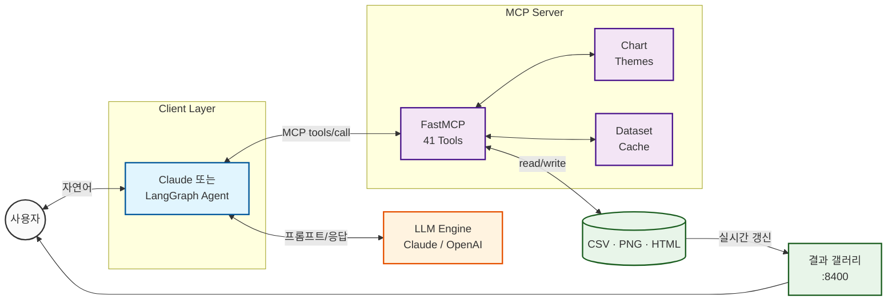

<div align="center">

# Data-Analyze-MCP

**자연어 한 마디로 데이터 분석, 전처리, 시각화까지 — LLM을 위한 MCP 데이터 분석 서버**

[](https://www.python.org/)
[](https://modelcontextprotocol.io/)
[](#mcp-server-tools-41-total)
[](https://claude.ai/)
[](https://github.com/chaeminyoon/Data-Analyze-MCP/actions)
[](LICENSE)

[빠른 시작](#quick-start) · [시연](#demo--분석--처리--시각화) · [차트 테마](#chart-themes) · [도구 목록](#mcp-server-tools-41-total) · [LLM 연동 가이드](docs/LLM_INTEGRATION.md)


</div>

---

## Features

- **Auto Visualization** — 어떤 CSV를 넣어도 컬럼 역할(수치/범주/날짜/ID 등)을 자동 판별해 알맞은 차트를 추천하고 그 자리에서 렌더링 (`recommend_visualizations` → `plot_auto`)
- **차트 테마 시스템** — `modern`(기본), `dark`, `minimal`, `vibrant`, `classic` 5종. 대화 중 "어둡게 바꿔줘" 한 마디면 이후 모든 차트의 디자인이 전환됨 (`set_chart_style`)
- **결과 즉시 확인** — 차트를 MCP 이미지로 대화창에 인라인 표시(`view_chart`), CLI에서는 OS 뷰어 자동 오픈, 웹 결과 갤러리(`data-analysis-viewer`)로 실시간 모니터링
- **41개 전문 도구** — 프로파일링, 전처리(결측/이상치/인코딩/스케일링), 피처 엔지니어링, 정적/인터랙티브 시각화, 가설검정, 모델 비교/평가/튜닝
- **한국어 우선** — 한글 컬럼명과 축 레이블 지원, 한국어 응답 시스템 프롬프트 내장
- **어떤 데이터든 안전하게** — 빈 파일, 전체 NaN, 단일 클래스, 고카디널리티 등 엣지 입력도 크래시 없이 명확한 에러로 응답하여 LLM이 스스로 회복

## Demo — 분석 → 처리 → 시각화

실제 사용 흐름 그대로입니다. 사용자는 자연어로 묻고, LLM이 MCP 툴을 골라 호출하며,
아래 수치와 차트는 전부 서버가 실제로 반환한 무편집 결과물입니다.

**1. 분석** — 데이터를 파악합니다.

```
You: house_price.csv 분석해줘
AI:  545행 x 12컬럼입니다. price 컬럼에서 이상치 34개(6.2%)가 탐지됩니다.
     [get_dataset_info, detect_outliers 호출]
```

**2. 처리** — 이상치를 제거하고, 전/후를 한 장으로 비교합니다.

```
You: 이상치 제거하고 전후를 비교해서 보여줘
AI:  34행을 제거했습니다. (545, 12) → (511, 12)
     전/후 비교 차트입니다 — 왼쪽의 130만 이상 꼬리가 오른쪽에서 사라졌습니다.
     [remove_outliers → plot_before_after → view_chart 호출, 차트 인라인 표시]
```

<div align="center"></div>

`plot_before_after`는 디스크의 원본과 캐시의 처리본을 같은 축으로 나란히 그려,
전처리가 무엇을 바꿨는지 한 장에서 비교됩니다.

**3. 시각화** — 정제된 데이터로 자동 추천을 받아 그립니다.

```
You: 어떤 시각화가 좋을지 추천하고 그려줘
AI:  area-price 상관이 |r|=0.80으로 가장 강합니다 (제거 전 0.33 → 제거 후 0.80).
     산점도를 생성했고 bedrooms로 색을 구분했습니다.
     [recommend_visualizations → plot_auto → view_chart 호출, 차트 인라인 표시]
```

<div align="center"></div>

전처리가 시각화를 바꿉니다 — 이상치 제거만으로 상관계수가 0.33에서 0.80으로 올라간 것이
그대로 차트에 드러납니다. 이 대화의 실제 MCP 요청/응답 JSON은
[docs/LLM_INTEGRATION.md](docs/LLM_INTEGRATION.md)에 있습니다.

## Chart Themes

모든 차트 도구는 활성 테마를 통해 그려집니다. 대화 중 전환할 수 있고
(`set_chart_style`), 서버 시작 시 `MCP_CHART_THEME` 환경변수로도 지정합니다.

| dark | minimal | vibrant |
|:---:|:---:|:---:|
|  |  |  |

| 테마 | 용도 |
|---|---|
| `modern` (기본) | 차분한 전문가 팔레트, 옅은 그리드, 좌측 정렬 타이틀 |
| `dark` | 다크 배경 + 밝은 파스텔 — 대시보드, 발표 |
| `minimal` | 단일 액센트 + 그레이스케일 — 보고서, 논문 |
| `vibrant` | 고채도, 강한 대비 — 프레젠테이션 강조 |
| `classic` | matplotlib/plotly 기본 스타일 (기존 형태) |

## Quick Start

```bash
git clone https://github.com/chaeminyoon/Data-Analyze-MCP.git
cd Data-Analyze-MCP
pip install -e .                        # 서버 + 클라이언트 + 뷰어 설치
python generate_all_test_data.py        # 데모 데이터 3종 생성 (선택)
```

### Claude Desktop / Claude Code

`claude_desktop_config.json` 또는 `.mcp.json`:

```json
{
  "mcpServers": {
    "data-analysis": {
      "command": "data-analysis"
    }
  }
}
```

이후 Claude에게 그냥 말하면 됩니다: *"house_price.csv 분석하고 이상치 제거한 다음 시각화해줘"*
— 차트가 대화창 안에 바로 표시됩니다.

### OpenAI API (동봉 클라이언트)

```bash
export OPENAI_API_KEY=sk-... MODEL_NAME=gpt-4o-mini
python data_client.py
```

턴이 끝날 때마다 새 차트가 OS 기본 뷰어로 자동으로 열립니다 (`AUTO_OPEN_RESULTS=0`으로 끔).

### 실시간 결과 갤러리

```bash
data-analysis-viewer            # http://127.0.0.1:8400
```

분석과 나란히 띄워두면 생성되는 결과물이 3초마다 자동 갱신됩니다.
PNG는 그리드로 렌더링, 인터랙티브 Plotly HTML은 새 탭으로 열립니다. 추가 의존성 없음.

## MCP Server Tools (41 Total)

<details>
<summary><b>Exploration & Profiling</b> (4) — 데이터 파악</summary>

| Tool | Description |
|------|-------------|
| `get_dataset_info` | 데이터셋 기본 정보 (shape, dtypes, 결측치) |
| `profile_dataset` | 종합 프로파일링 (통계량, 상관관계, 분포) |
| `detect_data_types` | 컬럼 역할 자동 분류 (수치/범주/날짜/ID/텍스트) |
| `find_duplicates` | 중복 행 탐지 및 카운트 |
</details>

<details>
<summary><b>Preprocessing</b> (5) — 정제</summary>

| Tool | Description |
|------|-------------|
| `handle_missing_values` | 결측치 처리 (mean, median, mode, drop, ffill) |
| `detect_outliers` | 이상치 탐지 (IQR, Z-score) |
| `remove_outliers` | 이상치 제거 (탐지된 전체) |
| `encode_categorical` | 범주형 인코딩 (Label, One-hot) |
| `scale_features` | 스케일링 (Standard, MinMax) |
</details>

<details>
<summary><b>Feature Engineering</b> (3) — 피처 생성</summary>

| Tool | Description |
|------|-------------|
| `create_derived_feature` | 수식 기반 파생 변수 (`df.eval`) |
| `create_polynomial_features` | 다항·교호작용 피처 |
| `extract_datetime_features` | 날짜/시간 피처 (year, month, dayofweek 등) |
</details>

<details open>
<summary><b>Auto Visualization</b> (2) — 자동 추천·렌더링</summary>

| Tool | Description |
|------|-------------|
| `recommend_visualizations` | 데이터 자동 분석 → 근거 있는 차트 추천 + 실행 가능한 tool_call |
| `plot_auto` | 컬럼 1~3개(또는 생략)로 차트 자동 선택·렌더링 (`interactive` 지원) |

수치→히스토그램 · 범주→막대 · 수치×수치→산점도 · 수치×범주→박스플롯 · 날짜×수치→라인 · 범주×범주→교차표 · +범주→hue/그룹
</details>

<details>
<summary><b>Chart Style</b> (2) — 디자인 테마</summary>

| Tool | Description |
|------|-------------|
| `list_chart_styles` | 사용 가능한 테마 목록과 현재 테마 |
| `set_chart_style` | 이후 모든 차트의 디자인 전환 (modern/dark/minimal/vibrant/classic) |
</details>

<details>
<summary><b>Visualization</b> (12) — 정적 PNG + 인터랙티브 HTML</summary>

| Tool | Description |
|------|-------------|
| `plot_histogram` / `plot_boxplot` / `plot_scatter` | 커스터마이징 가능한 기본 차트 |
| `plot_before_after` | 전처리 전/후를 같은 축으로 나란히 비교 (histogram/boxplot) |
| `plot_line` | 시계열 라인 (그룹·리샘플링, `interactive`) |
| `plot_bar` | 범주 빈도/집계 막대 (top_n, `interactive`) |
| `plot_correlation_heatmap` | 상관관계 히트맵 |
| `analyze_target_distribution` | 타깃 분포 + 불균형 탐지 |
| `plot_interactive_scatter/histogram/boxplot/heatmap` | Plotly HTML (줌·호버) |
</details>

<details>
<summary><b>Machine Learning</b> (3) — 모델링</summary>

| Tool | Description |
|------|-------------|
| `compare_models` | RandomForest / XGBoost / LogisticRegression / Linear 성능 비교 |
| `evaluate_model` | Confusion Matrix, Feature Importance, 상세 메트릭 |
| `tune_hyperparameters` | GridSearchCV / RandomizedSearchCV |
</details>

<details>
<summary><b>Statistical Analysis</b> (6) — 가설검정</summary>

| Tool | Description |
|------|-------------|
| `calculate_correlation` | Pearson / Spearman / Kendall |
| `test_normality` | Shapiro-Wilk 정규성 검정 |
| `test_ttest` / `test_anova` | 그룹 간 평균 비교 |
| `test_chi_square` | 범주형 독립성 검정 |
| `calculate_confidence_interval` | 평균 신뢰구간 |
</details>

<details>
<summary><b>Data & Results Management</b> (4) — 캐시·결과물</summary>

| Tool | Description |
|------|-------------|
| `list_cached_datasets` / `clear_cache` | 인메모리 데이터셋 캐시 관리 |
| `view_chart` | 차트를 대화창에 인라인 표시 (MCP 이미지 콘텐츠) |
| `list_outputs` | 생성된 결과물 목록 (최신순) |
</details>

## Architecture



역할 분담: LLM은 *어떤 툴을 어떤 인자로 부를지*만 결정하고, 실제 연산(pandas/sklearn/matplotlib)은
전부 서버가 수행합니다. 잘못된 입력은 `isError`와 명확한 메시지로 반환되어 LLM이 스스로 수정합니다.

## Project Structure

<details>
<summary>펼쳐 보기</summary>

```
Data-Analyze-MCP/
├── src/data_analysis/          # MCP 서버 패키지 (python -m data_analysis)
│   ├── server.py               #   공유 FastMCP 인스턴스 + 테마 초기화
│   ├── theming.py              #   차트 테마 시스템 (5종 프리셋)
│   ├── viewer.py               #   결과 갤러리 웹 UI (:8400)
│   ├── config.py               #   환경변수 기반 설정
│   ├── cache.py / helpers.py   #   데이터셋 캐시 · 공통 헬퍼
│   ├── fonts.py / prompts.py   #   한글 폰트 · 시스템 프롬프트
│   └── tools/                  #   도메인별 41개 도구
│       ├── exploration.py         ├── preprocessing.py
│       ├── feature_engineering.py ├── visualization.py
│       ├── auto_viz.py            ├── style.py
│       ├── results.py             ├── ml.py
│       └── statistics.py
├── data_client.py              # LangGraph 대화형 클라이언트 (OpenAI)
├── examples/demo_session.py    # LLM-MCP 세션 재현 스크립트
├── docs/LLM_INTEGRATION.md     # 실측 인풋/아웃풋 가이드
├── generate_all_test_data.py   # 데모 데이터 3종 생성기
└── pyproject.toml              # src-layout 패키지 (pip install -e .)
```
</details>

## Configuration

| 환경변수 | 기본값 | 설명 |
|---|---|---|
| `MCP_CHART_THEME` | `modern` | 시작 시 차트 테마 (modern/dark/minimal/vibrant/classic) |
| `MCP_OUTPUT_DIR` | `outputs/` | 차트·내보내기 저장 위치 |
| `MODEL_NAME` | `gpt-4o-mini` | 동봉 클라이언트의 모델 ID |
| `AUTO_OPEN_RESULTS` | `1` | CLI 결과 자동 열기 (0=끔) |
| `MCP_CLASSIFICATION_MAX_UNIQUE` | `10` | 분류/회귀 판별 임계값 |

## Documentation

- [LLM 연동 가이드](docs/LLM_INTEGRATION.md) — Claude/OpenAI 연결법 + 실측 4턴 세션의 MCP JSON 전문
- [세션 재현](examples/demo_session.py) — API 키 없이 문서의 인풋/아웃풋 그대로 재실행

---

<div align="center">
<sub>Python 3.11+ · FastMCP · pandas / scikit-learn / matplotlib / seaborn / plotly · 데모 데이터셋 3종 동봉</sub>
</div>
