<div align="center">
**English** | [한국어](README.ko.md)

# Data-Analyze-MCP
**Data analysis, preprocessing, and visualization from a single natural-language request — an MCP data-analysis server for LLMs**

[](https://www.python.org/)
[](https://modelcontextprotocol.io/)
[](#mcp-server-tools-60-total)
[](https://claude.ai/)
[](https://github.com/chaeminyoon/Data-Analyze-MCP/actions)
[](LICENSE)

[Quick Start](#quick-start) · [Demo](#demo--analyze--process--visualize) · [Usage Scenarios](#usage-scenarios) · [Case Study](#case-study--maritime-data-in-6-chapters) · [Chart Themes](#chart-themes) · [Tool List](#mcp-server-tools-60-total) · [LLM Integration Guide](docs/LLM_INTEGRATION.md)


</div>

---

## At a Glance

|  |  |  |
|---|---|---|
| **60** specialist tools · 11 domain modules | **5** accessibility-validated chart themes | **2** LLM backends (Claude · OpenAI) |
| **58** tests · **4**-way CI matrix | **0**-dependency palette validator | **~4.2K** LOC (`src/`) |

> **One-sentence summary** — An MCP server that takes a CSV and a natural-language request all the way through profiling → preprocessing → visualization → model diagnostics. **The LLM only decides which tool to call; the server owns every computation and every accessibility guarantee.** Color-vision-deficiency and contrast checks are enforced by pytest, so the server returns **validated charts**, not merely pretty ones — that is the core differentiator.

## Features

- **Auto Visualization** — feed in any CSV: column roles (numeric / categorical / datetime / ID …) are detected automatically, suitable charts are recommended with reasons, and rendered on the spot (`recommend_visualizations` → `plot_auto`)
- **Chart theme system** — 5 themes: `modern` (default), `dark`, `minimal`, `vibrant`, `classic`. One sentence mid-conversation — "switch to dark" — restyles every chart that follows (`set_chart_style`)
- **Computationally validated palettes** — every theme passes four accessibility checks (OKLCH lightness band · chroma floor · adjacent-pair separation ΔE≥12 under 3 color-vision-deficiency simulations · 3:1 contrast against the background), **enforced by pytest**. The validator is pure Python ([`palette_check.py`](src/data_analysis/palette_check.py)) and runs in CI on every commit
- **See results instantly** — charts display inline in the conversation as MCP images (`view_chart`), the CLI auto-opens the OS viewer, and a live web results gallery (`data-analysis-viewer`) monitors output in real time
- **60 specialist tools** — profiling, preprocessing (missing values / outliers / encoding / scaling), feature engineering, static & interactive visualization, composition & comparison charts, distribution & data-quality diagnostics, hypothesis testing, model comparison / evaluation / tuning / diagnostics
- **Korean-first** — Korean column names and axis labels are supported, with a Korean-response system prompt built in
- **Safe on any data** — empty files, all-NaN columns, single-class targets, high-cardinality categories: edge inputs come back as clear errors instead of crashes, so the LLM recovers on its own

## Demo — Analyze → Process → Visualize

This is the actual usage flow. The user asks in natural language, the LLM picks and calls MCP tools,
and every number and chart below is an unedited result actually returned by the server.

**1. Analyze** — get to know the data.

```
You: analyze house_price.csv
AI:  545 rows x 12 columns. 34 outliers (6.2%) detected in the price column.
     [calls get_dataset_info, detect_outliers]
```

**2. Process** — remove the outliers and compare before/after in one image.

```
You: remove the outliers and show me a before/after comparison
AI:  Removed 34 rows. (545, 12) → (511, 12)
     Here is the comparison chart — the tail above 1.3M on the left is gone on the right.
     [calls remove_outliers → plot_before_after → view_chart, chart displayed inline]
```

<div align="center"></div>

`plot_before_after` draws the original from disk and the processed version from cache
side by side on the same axes, so you can see in a single image what preprocessing changed.

**3. Visualize** — get automatic recommendations on the cleaned data and plot them.

```
You: recommend the best visualization and draw it
AI:  The area-price correlation is the strongest at |r|=0.80 (0.33 before removal → 0.80 after).
     Generated a scatter plot, colored by bedrooms.
     [calls recommend_visualizations → plot_auto → view_chart, chart displayed inline]
```

<div align="center"></div>

Preprocessing changes the visualization — removing outliers alone lifted the correlation
from 0.33 to 0.80, and the chart shows it directly. The full MCP request/response JSON
of this conversation is in [docs/LLM_INTEGRATION.md](docs/LLM_INTEGRATION.md).

## Chart Themes

Every chart tool draws through the active theme. You can switch mid-conversation
(`set_chart_style`) or set it at server start with the `MCP_CHART_THEME` environment variable.

| dark | minimal | vibrant |
|:---:|:---:|:---:|
|  |  |  |

| Theme | Use for |
|---|---|
| `modern` (default) | Calm professional palette, light grid, left-aligned titles |
| `dark` | Palette recomputed specifically for dark surfaces — dashboards, talks |
| `minimal` | Muted tones, minimal grid — reports, papers |
| `vibrant` | High chroma, strong contrast — presentation emphasis |
| `classic` | matplotlib/plotly default styles (legacy compatibility, accessibility not validated) |

Every palette except `classic` maintains ΔE ≥ 25 between adjacent slots under
color-vision-deficiency simulation (protan/deutan/tritan) and meets 3:1 contrast on each
theme's own background. The slot **order itself is a safety mechanism** — it was chosen by
exhaustive search to maximize the minimum adjacent-pair ΔE, so arbitrarily reordering series
colors makes the tests fail. When a palette would need more than 8 colors, the answer is not
more colors but folding into 'Other' (`fold_other`) or small multiples
(`plot_small_multiples`). There is deliberately no dual-axis (two y-axes) tool.

## Usage Scenarios

The 60 tools shine as **workflows**, not as isolated calls. Four common flows,
with the tool chain the LLM actually ends up calling at each step.

### 1. Understand an unfamiliar dataset in 10 minutes

```
"Can I trust this CSV? Walk me through it, structure to quality"
```

`profile_dataset` → `plot_missingness` (is the missingness random or structural?) →
`find_duplicates` → `recommend_visualizations` → render the top `plot_auto` picks.
Missingness diagnosis comes first because **a chart of unknown-quality data is a
plausible lie**. Above 5% missing, the auto-recommendation list adds a missingness
diagnostic on its own.

<div align="center">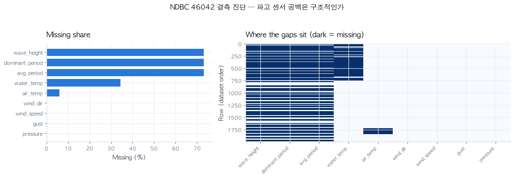</div>
<div align="center"><sub>Real run — NDBC buoy data: per-column missing rates on the left; the matrix on the right reveals the wave-height sensor's gaps are time-block structured, not random.</sub></div>

### 2. Build report and presentation material

```
"Make it minimal for a report, and summarize the top revenue drivers as a Pareto"
```

`set_chart_style("minimal")` → `plot_pareto` (how many items make 80%?) →
`plot_stacked_bar(normalize=True)` (composition comparison) → `stat_tile` (hero-number card) →
drop the generated PNGs straight into the document. For slides, a single
`set_chart_style("dark")` re-renders the same charts with a dark-surface palette — every
theme passes the CVD and contrast checks, so **the projector in the meeting room and the
colleague with color vision deficiency both get the same information**.

<div align="center">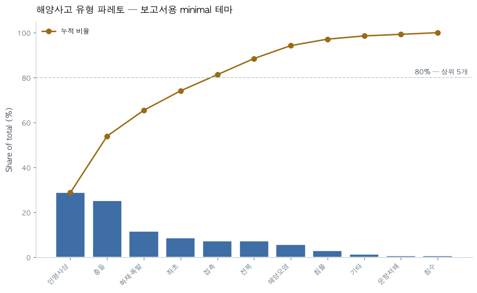</div>
<div align="center"><sub>Real run — KMST accident-type Pareto in the minimal theme: muted tones + a single % axis, 80% crossover annotated, ready to paste into a report.</sub></div>

### 3. Model development loop

```
"Build a churn model and tell me whether I should collect more data"
```

`compare_models` (baseline) → `tune_hyperparameters` →
`plot_learning_curve` (if the validation curve is still climbing, more data is the answer) →
`plot_roc_pr` (with imbalance, PR tells the truth) → `plot_calibration` (the precondition for
threshold-based decisions) → for regression, `plot_residuals` (structural flaws R² can't see).
What you end up with is not a single accuracy number but **a set of evidence for
"why this model can be trusted"**.

<div align="center">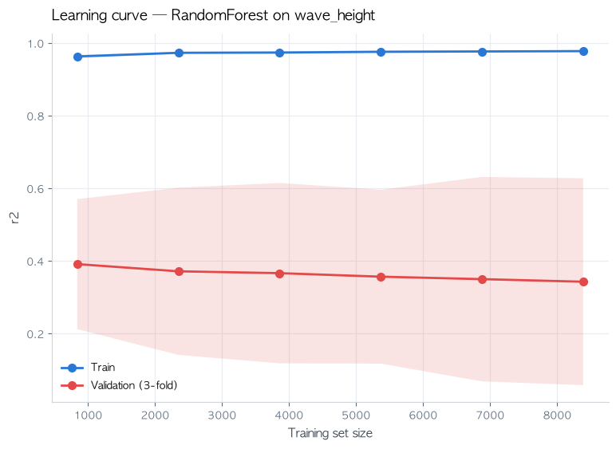</div>
<div align="center"><sub>Real run — predicting wave height from buoy data: the 0.63 gap between train and validation curves says "right now it is memorizing noise".</sub></div>

### 4. Answer a business question with one chart

| Question | The one tool that answers it |
|---|---|
| "Which channels make 80% of revenue?" | `plot_pareto` |
| "Why did the total drop vs last quarter?" | `plot_waterfall` (per-item contribution breakdown) |
| "Average unit price by region × product?" | `plot_pivot_heatmap` |
| "What changed per branch, last year vs this year?" | `plot_slope` |
| "Just one key metric for this month" | `stat_tile` (when the answer is a number, not drawing a chart is the right call) |

<div align="center">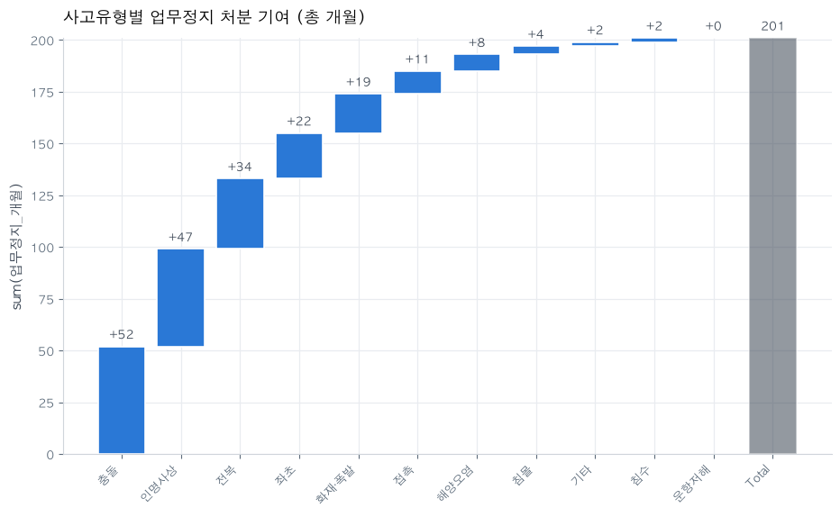</div>
<div align="center"><sub>Real run — "201 total months of suspensions: where did they come from?" — one waterfall: collisions (+52) and casualties (+47) are half of it.</sub></div>

Every output can be **displayed inline in the conversation** with a single `view_chart` call —
it returns MCP ImageContent (base64 PNG), so multimodal clients like Claude Desktop/Code show
the result immediately without opening files (verified over the actual stdio protocol).

## Case Study — Maritime Data in 6 Chapters

How the tools chain into a single analysis story on two real datasets:
the **NOAA NDBC 46042 buoy** (Monterey Bay, 47,137 observations from 2023 — auto-downloaded
by the script) and **139 KMST (Korea Maritime Safety Tribunal) verdicts** (bundled). Every
chart below is unedited tool output reproduced by one run of
[`examples/maritime_case_study.py`](examples/maritime_case_study.py), and each chapter notes
**which design rule intervenes and why**.

<div align="center">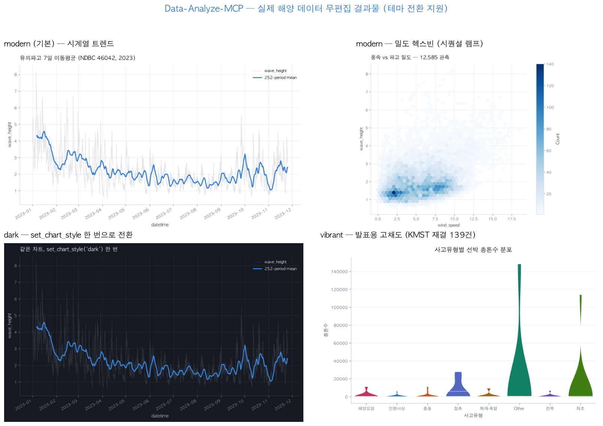</div>

### Ch. 1 · Trend — smoothing must not hide the data

```
"Show me last year's wave-height trend. Clean up the noise but don't erase the raw data"
```

<div align="center">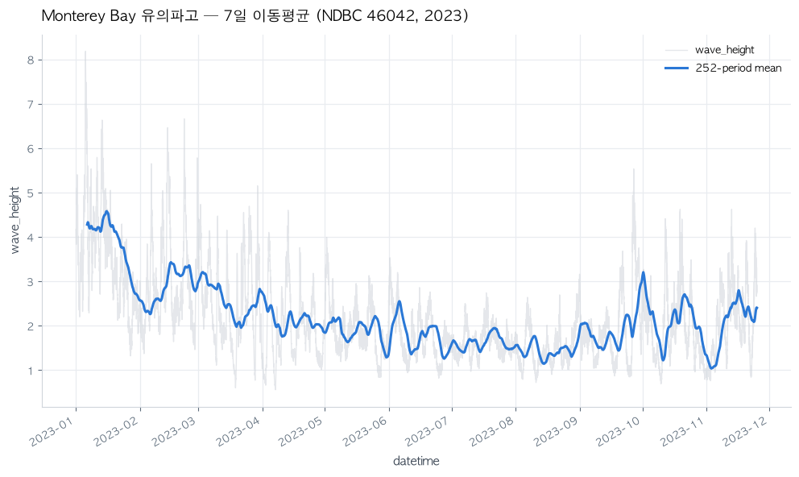</div>

`plot_rolling` — all 12,585 raw observations stay in the background (muted gray) and only
the 7-day moving average gets the primary color. The Jan–Mar storm season reads as a trend
line while individual storm spikes never disappear. **Design rule: one color for emphasis,
muted for context — color is hierarchy.**

### Ch. 2 · Relationships — past ten thousand points, scatter plots lie

<div align="center">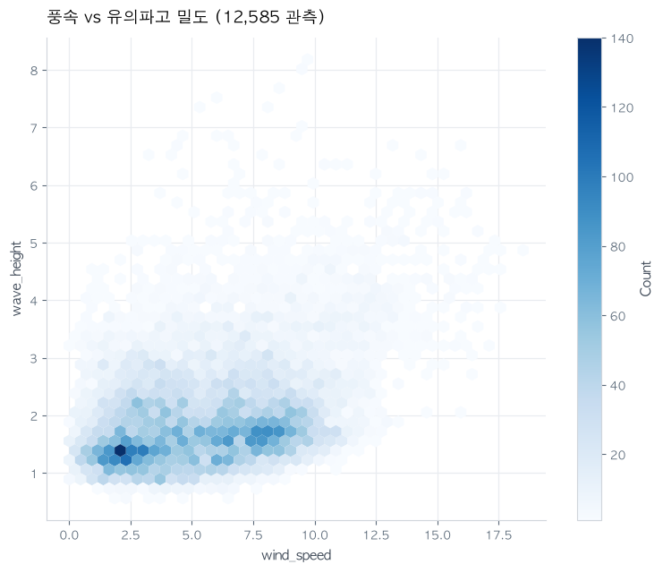</div>

`plot_hexbin` — the same data as a scatter plot collapses into one blob. Encoding density
as a **sequential ramp** (one hue, light→dark) reveals the structure: wave-height variance
grows as wind strengthens. **Design rule: encode continuous quantities with the lightness
of one hue, not with many hues.**

### Ch. 3 · Distributions — test statistics and visual diagnostics are a set

<div align="center">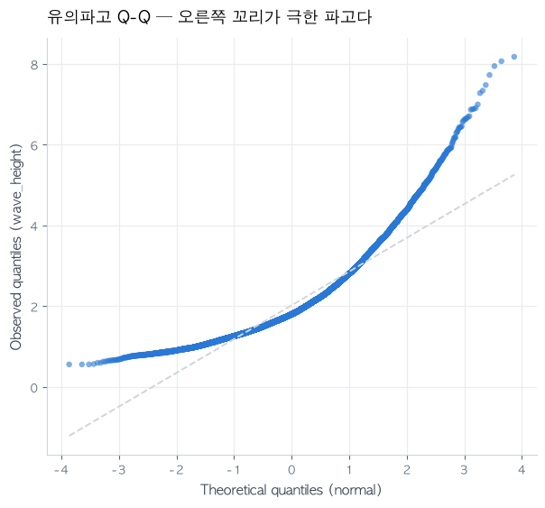</div>

`test_normality` (Shapiro p≈0, not normal) + `plot_qq` — the test only says "it isn't";
the Q-Q plot shows **how** it isn't: the right end escaping above the reference line is
the heavy right tail — extreme wave heights. For design-load calculations, that tail is
the whole point.

### Ch. 4 · Predictability — two curves, not one accuracy number

<div align="center"></div>

`plot_learning_curve` — predicting wave height from wind speed, gust, wave period, and
pressure gives validation R² 0.34 with a generalization gap of 0.63. The two curves
diagnose it: "these features aren't enough, and right now it is memorizing noise."
**Design rule: uncertainty (±1σ) as a light filled band, and two series always get a legend.**

### Ch. 5 · Priority and contribution — two questions to ask accident data

<div align="center">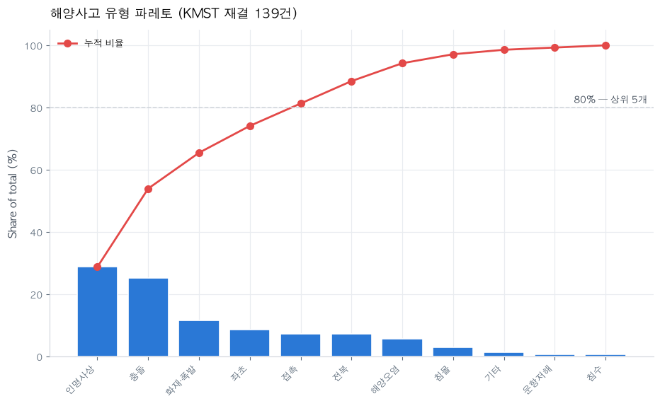</div>
<div align="center"></div>

`plot_pareto` — the top 5 types (casualties, collision, fire/explosion, grounding, contact)
make up 80% of the verdicts. Bars (individual share) and the cumulative line share a
**single % axis** — no dual axis. `plot_waterfall` — decomposing the 201 total months of
suspensions by type: collision (+52) and casualties (+47) are half.
**Design rule: direct labels on every bar; +/− take palette colors 1 and 2.**

### Ch. 6 · When the answer is a single number

<div align="center">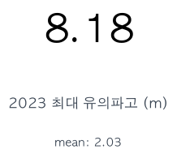</div>

`stat_tile` — the answer to "what was last year's maximum wave height?" is the number
8.18 m, not a chart. **Design rule: not drawing what doesn't need to be drawn is also a
visualization decision.**

```bash
# Full reproduction (buoy data auto-downloads once, ~4MB)
python examples/maritime_case_study.py
```

## Quick Start

```bash
git clone https://github.com/chaeminyoon/Data-Analyze-MCP.git
cd Data-Analyze-MCP
pip install -e .                        # installs server + client + viewer
python generate_all_test_data.py        # generate 3 demo datasets (optional)
```

### Claude Desktop / Claude Code

`claude_desktop_config.json` or `.mcp.json`:

```json
{
  "mcpServers": {
    "data-analysis": {
      "command": "data-analysis"
    }
  }
}
```

Then just talk to Claude: *"analyze house_price.csv, remove the outliers, then visualize it"*
— charts appear right inside the conversation.

### OpenAI API (bundled client)

```bash
export OPENAI_API_KEY=sk-... MODEL_NAME=gpt-4o-mini
python data_client.py
```

At the end of each turn, new charts open automatically in the OS default viewer
(disable with `AUTO_OPEN_RESULTS=0`).

### Live results gallery

```bash
data-analysis-viewer            # http://127.0.0.1:8400
```

Keep it open next to your analysis and generated outputs refresh every 3 seconds.
PNGs render as a grid; interactive Plotly HTML opens in a new tab. No extra dependencies.

## MCP Server Tools (60 Total)

<details>
<summary><b>Exploration & Profiling</b> (4) — understand the data</summary>

| Tool | Description |
|------|-------------|
| `get_dataset_info` | Basic dataset info (shape, dtypes, missing values) |
| `profile_dataset` | Comprehensive profiling (statistics, correlations, distributions) |
| `detect_data_types` | Automatic column-role classification (numeric/categorical/datetime/ID/text) |
| `find_duplicates` | Detect and count duplicate rows |
</details>

<details>
<summary><b>Preprocessing</b> (5) — clean</summary>

| Tool | Description |
|------|-------------|
| `handle_missing_values` | Missing-value handling (mean, median, mode, drop, ffill) |
| `detect_outliers` | Outlier detection (IQR, Z-score) |
| `remove_outliers` | Outlier removal (all detected) |
| `encode_categorical` | Categorical encoding (Label, One-hot) |
| `scale_features` | Scaling (Standard, MinMax) |
</details>

<details>
<summary><b>Feature Engineering</b> (3) — create features</summary>

| Tool | Description |
|------|-------------|
| `create_derived_feature` | Formula-based derived columns (`df.eval`) |
| `create_polynomial_features` | Polynomial & interaction features |
| `extract_datetime_features` | Datetime features (year, month, dayofweek, …) |
</details>

<details open>
<summary><b>Auto Visualization</b> (2) — automatic recommendation & rendering</summary>

| Tool | Description |
|------|-------------|
| `recommend_visualizations` | Auto-analyzes the data → reasoned chart recommendations + executable tool_call |
| `plot_auto` | Auto-selects and renders a chart from 1–3 columns (or none) (`interactive` supported) |

numeric→histogram · categorical→bar · numeric×numeric→scatter · numeric×categorical (≤8 levels)→boxplot ·
numeric×categorical (9–16 levels)→small multiples · datetime×numeric→line · categorical×categorical→crosstab ·
+categorical→hue/grouping. The recommendation list automatically includes time×composition→area chart,
and a missingness diagnostic when missing values exceed 5%.
</details>

<details>
<summary><b>Chart Style</b> (2) — design themes</summary>

| Tool | Description |
|------|-------------|
| `list_chart_styles` | Available themes and the current one |
| `set_chart_style` | Switch the design of every subsequent chart (modern/dark/minimal/vibrant/classic) |
</details>

<details>
<summary><b>Visualization</b> (15) — static PNG + interactive HTML</summary>

| Tool | Description |
|------|-------------|
| `plot_histogram` / `plot_boxplot` / `plot_scatter` | Customizable basic charts |
| `plot_before_after` | Before/after preprocessing side by side on shared axes (histogram/boxplot) |
| `plot_line` | Time-series lines (grouping, resampling, `interactive`) |
| `plot_rolling` | Raw series (muted) + moving average (primary) — trend inside noise |
| `plot_bar` | Categorical frequency/aggregate bars (top_n, `interactive`) |
| `plot_correlation_heatmap` | Correlation heatmap (diverging ramp) |
| `plot_pivot_heatmap` | Category×category×numeric aggregate heatmap — not "how many" but "how much" |
| `plot_hexbin` | Density hexbin — the replacement when tens of thousands of points smear a scatter plot |
| `analyze_target_distribution` | Target distribution + imbalance detection |
| `plot_interactive_scatter/histogram/boxplot/heatmap` | Plotly HTML (zoom & hover) |
</details>

<details>
<summary><b>Composition & Comparison</b> (6)</summary>

| Tool | Description |
|------|-------------|
| `plot_stacked_bar` | Stacked bars (100% normalization, 'Other' folding above 9 levels, segment gaps) |
| `plot_area` | Stacked area — total and composition over time (resampling supported) |
| `plot_slope` | Slope chart — per-item change between two points in time, direct labels at both ends |
| `plot_small_multiples` | Small multiples — mini charts per category on shared axes (split instead of color cycling) |
| `plot_pareto` | Pareto — how many items make 80%, single % axis (no dual axis) |
| `plot_waterfall` | Waterfall — per-item contribution to a total change (+/− colors, direct labels) |
</details>

<details>
<summary><b>Distribution & Data Quality</b> (5) — distribution & quality diagnostics</summary>

| Tool | Description |
|------|-------------|
| `plot_ecdf` | Empirical CDF — read exact percentiles that histograms hide |
| `plot_violin` | Violin — exposes bimodal shapes that boxplots hide (quartiles built in) |
| `plot_missingness` | 2-panel missingness diagnostic — per-column rates + row-order matrix (structural gaps) |
| `plot_qq` | Q-Q plot — the visual companion to `test_normality` (skew & heavy-tail diagnosis) |
| `stat_tile` | Hero-number tile — the card to use instead of a chart when the answer is one number |
</details>

<details>
<summary><b>Machine Learning</b> (8) — modeling & diagnostics</summary>

| Tool | Description |
|------|-------------|
| `compare_models` | RandomForest / XGBoost / LogisticRegression / Linear comparison |
| `evaluate_model` | Confusion matrix, feature importance, detailed metrics |
| `tune_hyperparameters` | GridSearchCV / RandomizedSearchCV |
| `plot_roc_pr` | ROC + PR curves side by side (avoids the ROC-only illusion on imbalanced data, multiclass OvR) |
| `plot_calibration` | Calibration curve — are the probabilities honest? (the precondition for threshold decisions) |
| `plot_feature_importance` | Importance/|coefficient| horizontal bars — single color, direct labels |
| `plot_residuals` | Residuals vs predicted + residual distribution — structural flaws R² can't see |
</details>

<details>
<summary><b>Statistical Analysis</b> (6) — hypothesis testing</summary>

| Tool | Description |
|------|-------------|
| `calculate_correlation` | Pearson / Spearman / Kendall |
| `test_normality` | Shapiro-Wilk normality test |
| `test_ttest` / `test_anova` | Group-mean comparison |
| `test_chi_square` | Categorical independence test |
| `calculate_confidence_interval` | Confidence interval of the mean |
</details>

<details>
<summary><b>Data & Results Management</b> (4) — cache & outputs</summary>

| Tool | Description |
|------|-------------|
| `list_cached_datasets` / `clear_cache` | In-memory dataset cache management |
| `view_chart` | Display a chart inline in the conversation (MCP image content) |
| `list_outputs` | List generated outputs (newest first) |
</details>

## Architecture

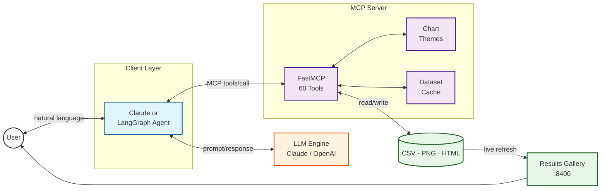

Division of labor: the LLM only decides *which tool to call with which arguments*; every actual
computation (pandas/sklearn/matplotlib) runs on the server. Invalid input comes back as `isError`
with a clear message, so the LLM corrects itself.

## Engineering Highlights

The **design decisions** behind the feature list. Each item is not "what was built" but "why it was decided that way".

- **Accessibility reduced to computation** — "is this color pretty" is subjective, but "can a colleague with color vision deficiency tell these two series apart" is computable. [`palette_check.py`](src/data_analysis/palette_check.py) implements sRGB→OKLab (Ottosson), CIELAB (D65), the Machado 2009 CVD matrices, and WCAG relative luminance **straight from the published formulas, with zero external dependencies**. The four checks every palette must pass (lightness band · chroma floor · adjacent-pair CVD ΔE · 3:1 background contrast) are enforced by pytest on every commit.
- **Palette order is itself a safety mechanism** — series colors are assigned in slot order, and that order is not arbitrary: it was chosen by **exhaustive search to maximize the minimum adjacent-pair CVD distance** ([`theming.py`](src/data_analysis/theming.py)). Reordering colors arbitrarily breaks the accessibility tests — mistakes don't pass silently.
- **The temptation to "add more colors" is blocked structurally** — when more than 8 colors would be needed, the solution is folding into 'Other' (`fold_other`) or small multiples (`plot_small_multiples`), not more colors. There is **deliberately no dual-axis (two y-axes) tool** — even the Pareto is drawn on a single % axis. If the tool doesn't exist, the bad chart can't happen.
- **Auto visualization is a rules engine** — `recommend_visualizations` classifies column roles (numeric/categorical/datetime/ID), picks charts by deterministic rules, and returns an **executable `tool_call`**. The shape of the data decides the chart, not the LLM's intuition. Above 5% missing values, a missingness diagnostic is inserted into the recommendations automatically.
- **Recovery instead of crashes on edge inputs** — empty files, all-NaN columns, single-class targets, high-cardinality categories: none of these kill the server. They return `isError` + a clear message so the LLM chooses its own next tool. A dedicated edge-case suite ([`test_edge_cases.py`](tests/test_edge_cases.py)) guards against regressions.
- **Graceful degradation of optional dependencies** — without `xgboost`, `compare_models` keeps working with the remaining models, and only errors clearly when XGBoost is requested explicitly ([`ml.py`](src/data_analysis/tools/ml.py)). The install environment never stops the server.
- **Results exposed through three paths** — MCP `ImageContent` (base64 PNG) inline for multimodal clients, auto-opened OS viewer for the CLI, and a 3-second-polling web gallery (`:8400`). Whatever the client, the user sees results immediately.

## Quality · Testing

The part that shows this is **maintained code**, not portfolio code.

- **4-way CI matrix** — Python `3.11`/`3.12` × pandas `2.2`/`3.0` run crosswise ([ci.yml](.github/workflows/ci.yml)). pandas 2 and 3 differ in string dtypes (`object` vs `str`), so both must stay green to catch string-handling regressions.
- **58 tests · ruff lint** — covering visualization, preprocessing, ML/statistics, auto-recommendation, palettes, edge cases, and server/results. Headless rendering is verified too, via `MPLBACKEND=Agg`.
- **Accessibility as a CI gate** — the four palette checks above are part of the test suite, so a commit that touches colors cannot merge without passing them.
- **PR-based development** — features landed as branch→PR→merge (`feat/chart-themes`, `feat/tests-ci-license`, …). The history reads one feature at a time.
- **Reproducible artifacts** — every demo and case-study image in this README is **unedited tool output** from [`scripts/generate_demo_images.py`](scripts/generate_demo_images.py) and [`examples/maritime_case_study.py`](examples/maritime_case_study.py). There are no hand-drawn mockups.

```bash
pip install -e ".[dev]"
ruff check src tests
pytest -q
```

## Project Structure

<details>
<summary>Expand</summary>

```
Data-Analyze-MCP/
├── src/data_analysis/          # MCP server package (python -m data_analysis)
│   ├── server.py               #   shared FastMCP instance + theme initialization
│   ├── theming.py              #   chart theme system (5 presets + sequential/diverging ramps)
│   ├── palette_check.py        #   palette accessibility validator (OKLCH·CVD·WCAG, zero deps)
│   ├── viewer.py               #   results gallery web UI (:8400)
│   ├── config.py               #   environment-variable configuration
│   ├── cache.py / helpers.py   #   dataset cache · shared helpers · mark specs
│   ├── fonts.py / prompts.py   #   Korean fonts · system prompts
│   └── tools/                  #   60 tools by domain
│       ├── exploration.py         ├── preprocessing.py
│       ├── feature_engineering.py ├── visualization.py
│       ├── composition.py         ├── distribution.py
│       ├── auto_viz.py            ├── style.py
│       ├── results.py             ├── ml.py
│       └── statistics.py
├── data_client.py              # LangGraph conversational client (OpenAI)
├── examples/demo_session.py    # LLM-MCP session replay script
├── examples/maritime_case_study.py  # reproduces the 6-chapter maritime case study (auto-downloads NDBC)
├── docs/LLM_INTEGRATION.md     # integration guide with captured real I/O
├── scripts/generate_demo_images.py  # regenerates README demo images (unedited tool output)
├── generate_all_test_data.py   # generator for the 3 demo datasets
└── pyproject.toml              # src-layout package (pip install -e .)
```
</details>

## Configuration

| Environment variable | Default | Description |
|---|---|---|
| `MCP_CHART_THEME` | `modern` | Chart theme at startup (modern/dark/minimal/vibrant/classic) |
| `MCP_OUTPUT_DIR` | `outputs/` | Where charts and exports are saved |
| `MODEL_NAME` | `gpt-4o-mini` | Model ID for the bundled client |
| `AUTO_OPEN_RESULTS` | `1` | Auto-open results from the CLI (0 = off) |
| `MCP_CLASSIFICATION_MAX_UNIQUE` | `10` | Classification/regression decision threshold |

## Documentation

- [LLM Integration Guide](docs/LLM_INTEGRATION.md) — Claude/OpenAI setup + full MCP JSON of a captured 4-turn session
- [Session replay](examples/demo_session.py) — re-run the documented I/O exactly, no API key needed
- [Maritime case study](examples/maritime_case_study.py) — reproduces all charts of the 6-chapter case study (real NDBC & KMST data)

---

<div align="center">
<sub>Python 3.11+ · FastMCP · pandas / scikit-learn / matplotlib / seaborn / plotly · 3 demo datasets included</sub>
</div>
